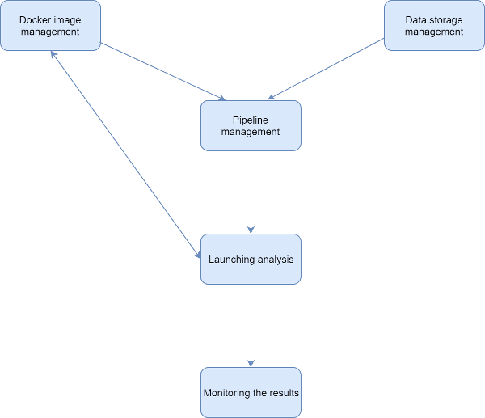
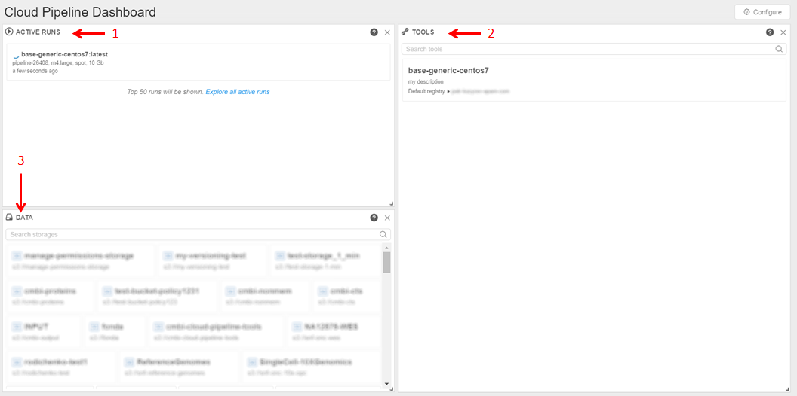
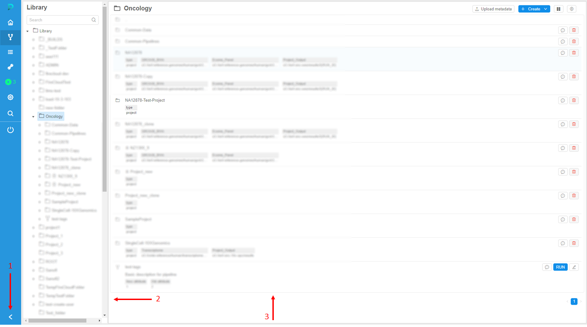

# 3. Overview

- [User Journey in a nutshell](#user-journey-in-a-nutshell)
- [GUI menu tab bar](#gui-menu-tab-bar)
    - [Home](#home)
    - [Library](#library)
    - [Cluster Nodes](#cluster-nodes)
    - [Tools](#tools)
    - [Runs](#runs)
    - [Settings](#settings)
    - [Search](#search)
    - [Logout](#logout)

## User Journey in a nutshell

**Cloud Pipeline (CP)** is a cloud-based web application which allows users to solve a wide range of analytical tasks and includes:

- **Data processing**: you can create data processing pipelines and run them in the cloud in an automated way.
- **Data storing**: create your data storage, download or upload data from it or edit text files within **CP** UI. File version control is supported.
- **Tool management**: you can create and deploy your own calculation environment using Docker's container concept.

This Manual is mostly around data processing lifecycle which, in a nutshell, can be described in these several steps:

1. To run a user's calculation script it shall be registered in **CP** as a **pipeline**. The script could be created in **CP** environment or uploaded from the local machine. See more details [6. Manage Pipeline](../06_Manage_Pipeline/6._Manage_Pipeline.md).  
    **_Note_**: If you need to run a pipeline in different environments simultaneously or set a specific type of data, you can use detach configuration object. See more [7. Manage Detached configuration](../07_Manage_Detached_configuration/7._Manage_Detached_configuration.md).
2. To store pipeline's inputs and outputs data files the **Data Storage** shall be determined in **CP**. Learn more [8. Manage Data Storage](../08_Manage_Data_Storage/8._Manage_Data_Storage.md).
3. Almost every pipeline requires a specific package of software to run it, which is defined in a docker image. So when a user starts a pipeline, **CP** starts a new cloud instance (nodes) and runs a docker image at it. See more details [9. Manage Cluster nodes](../09_Manage_Cluster_nodes/9._Manage_Cluster_nodes.md) and [10. Manage Tools](../10_Manage_Tools/10._Manage_Tools.md).
4. When the environment is set, pipeline starts execution. A user in **CP** can change and save configurations of the run. Learn more [6.2. Launch a pipeline](../06_Manage_Pipeline/6.2._Launch_a_pipeline.md).
5. A user can monitor the status of active and completed runs and usage of active instances in **CP**. Learn more [11. Manage Runs](../11_Manage_Runs/11._Manage_Runs.md) and [9. Manage Cluster nodes](../09_Manage_Cluster_nodes/9._Manage_Cluster_nodes.md).

**_Note_**: **CP** can run a docker image at instance without any pipeline at all if needed. There just will be an instance with some installed and running software. A user can SSH to it or use it in the interactive mode.  
**_Note_**: **CP** uses **Amazon's products** to store data and process it by default: Amazon AWS buckets, Amazon EC2.

Also, **CP** supports CLI, which duplicates some of GUI features and has extra features unavailable via GUI, such as automation of interaction with **CP** during the pipeline script running, or uploading considerable amount of data (more than 5 Gb), etc. The basics of CLI you can learn [here](../14_CLI/14._Command-line_interface.md).

## GUI menu tab bar

There are several menu tabs at the left edge of **CP** window.  

### Home

**Home** space is opened by default when Cloud Pipeline is loaded. It provides "personal" and often-used information for a user.  
By default, this dashboard shows 3 widgets:

- **Active Runs** (see picture below, **1**) displays a list of user's active runs. See more details [11. Manage Runs](../11_Manage_Runs/11._Manage_Runs.md#active-runs).  
    **_Note_**: press **Explore all active runs** to see a list of all runs.
- **Tools** (see picture below, **2**) shows a list of Tools in a user's personal repository and Tools available to your group. Learn more [10. Manage Tools](../10_Manage_Tools/10._Manage_Tools.md#personal-docker-repository-tool-group) and [13. Permissions](../13_Permissions/13._Permissions.md).  
    **_Note_**: group-level Tools will be shown on the top of the Tools list.  
    **_Note_**: user can search for a particular Tool by using the **Search tools** text box. System will suggest Tools based on a user's query.
- **Data** (see picture below, **3**) displays available Data Storages for a user - user shall have **OWNER** rights or **READ/WRITE** access to a Data Storage. See more [8. Manage Data Storage](../08_Manage_Data_Storage/8._Manage_Data_Storage.md) and [13. Permissions](../13_Permissions/13._Permissions.md).  
    **_Note_**: personal Data storages (i.e. a user is an **OWNER** of this Storage) will be shown on top, **WRITE** - second priority, **READ** - third priority.

Each widget has the **Help** icon . Hover this icon to get a brief description of a widget.
Learn more about **Home** tab [18. Home page](../18_Home_page/18._Home_page.md).

### Library

**Library** space supports a hierarchical view of its content:

- [Pipelines](../06_Manage_Pipeline/6._Manage_Pipeline.md) and its versions
- [Data Storages](../08_Manage_Data_Storage/8._Manage_Data_Storage.md)
- [Folders](../04_Manage_Folder/4._Manage_Folder.md)
- [Configurations](../07_Manage_Detached_configuration/7._Manage_Detached_configuration.md)
- [Metadata objects](../05_Manage_Metadata/5._Manage_Metadata.md).

The tab consists of two panels:

- **"Hierarchy"** view (see the picture below, **2**) displays a hierarchical-structured list of pipelines, folders, storages and machine configurations, etc.  
    Use the "**Search**" field to find a **CP** object by a name.
    "**Collapse/Expand**" button (see the picture below, **1**) at the bottom-left corner of the screen: use it to collapse or expand **"Hierarchy"** view.
- **"Details"** view (see the picture below, **3**) shows details of a selected item in hierarchy panel. Depends on a selected type of object it has a very different view. You can learn about each on respective pages of the manual.

**_Note_**: Each time **"Hierarchy"** view loads, the first **Folder** in the hierarchy that has more than 1 child object (Folder, Pipeline, Data Storage, etc) is automatically selected. Contents of that Folder are automatically expanded.

### Cluster Nodes

This space provides a list of working nodes. You can get information on their usage and terminate them in this tab. See more details [9. Manage Cluster nodes](../09_Manage_Cluster_nodes/9._Manage_Cluster_nodes.md).

### Tools

**Tools** space displays available Docker images and their tools, organized in tool groups and docker registries. You can edit information about them and run nodes with any Docker image in this tab. See more details [10. Manage Tools](../10_Manage_Tools/10._Manage_Tools.md).

### Runs

This space helps you monitor the state of your run instances. You can get parameters and logs of a specific run, stop a run, rerun a completed run. Learn more [11. Manage Runs](../11_Manage_Runs/11._Manage_Runs.md).

### Settings

This tab opens a **Settings** window which allows:

- generate a CLI installation and configuration commands to set CLI for **CP**,
- manage system events notifications,
- manage roles and permissions.

See more details [12. Manage Settings](../12_Manage_Settings/12._Manage_Settings.md).

### Search

It's a search field which allows searching specific runs by its "Run ID" or "Parameters".

### Logout

This is a **Logout** button which logs you out.  
**_Note_**: if automatic logging-in is configured, you will be re-logged at once.  
**_Note_**: if any changes occur in the **CP** application during an authorized session, the changes are applied after re-login.