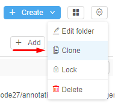
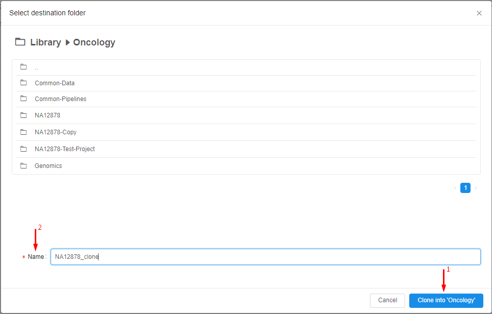

# 4.4. Clone a folder

This feature allows a user to clone any folder to a specific destination: to user's personal folder, or user's project. It would be helpful to create a new project way faster due to copying metadata, configurations, storages from another project.

> To copy a folder, you need **READ** permissions for the copied folder and **WRITE** permissions for a folder selected as a destination.  
> For more information see [13. Permissions](../13_Permissions/13._Permissions.md).

**_Note_**: learn more about metadata [here](../05_Manage_Metadata/5._Manage_Metadata.md).  
To clone a folder, the following steps shall be performed:

1. Navigate to the desired folder page.
2. Click  icon and choose **"Clone"** menu item.  
    
3. The **"Select destination folder"** will pop-up.  
    **_Note_**: The pop-up window will be open with parent folder of a copied folder as a default destination.  
    
4. Choose the destination if it needed by classical navigation actions.  
    **_Note_**: The **"Clone"** button (**1**) displays which destination is selected at the moment.
5. Name the new clone of the folder (**2**).  
    **_Note_**: The name shall not break the uniqueness principal: there shouldn't be two folders with the same name in one destination.
6. Click **"Clone"** button - and the folder will be cloned. The page of the clone of the folder will be open automatically. All child of the copied folder will be copied.  
    **_Note_**: The exception is pipelines. Pipelines won't be copied as far as it may cause the collision.  
    **_Note_**: The storages are copied by creating a new empty one with a unique name and path. No file will be copied from a copied storage to a new one.  
    