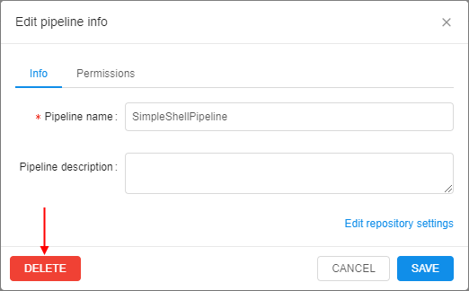
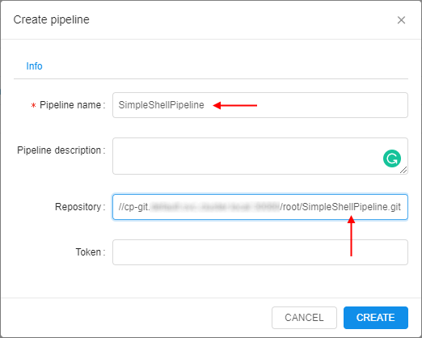

# 6.3. Delete and unregister Pipeline

- [Delete pipeline](#delete-pipeline)
- [Unregister pipeline](#unregister-pipeline)

> To delete a **Pipeline** you need to have **WRITE** permission for that pipeline and the **ROLE\_PIPELINE\_MANAGER** role. For more details see [13. Permissions](../13_Permissions/13._Permissions.md).

## Delete pipeline

1. Select a pipeline.
2. Click the **Gear** icon in the right upper corner of the pipeline page:  
    
3. In the popup click the **DELETE** button:  
    
4. You will be offered to unregister or delete a pipeline. Click the **Delete** button to remove the pipeline permanently:  
    

## Unregister pipeline

A user can unregister pipeline. Git repository neither will be deleted nor will be accessible in Cloud Pipeline.

Do the same actions as in the [**Delete pipeline**](#delete-pipeline) section but click the **Unregister** button at step **4**:  
    

If you want to register in the Cloud Pipeline the pipeline that was previously unregistered:

1. Start create a new pipeline. For details see [here](6.1._Create_and_configure_pipeline.md#create-a-pipeline-in-a-library-space).
2. At the "Create pipeline" popup click the "Edit repository settings" button. Into the "Repository" field specify the git repository address of the unregistered pipeline:  
      
    Specify a pipeline name.
3. Click the **CREATE** button.
4. The re-registered pipeline will appear in the library.
