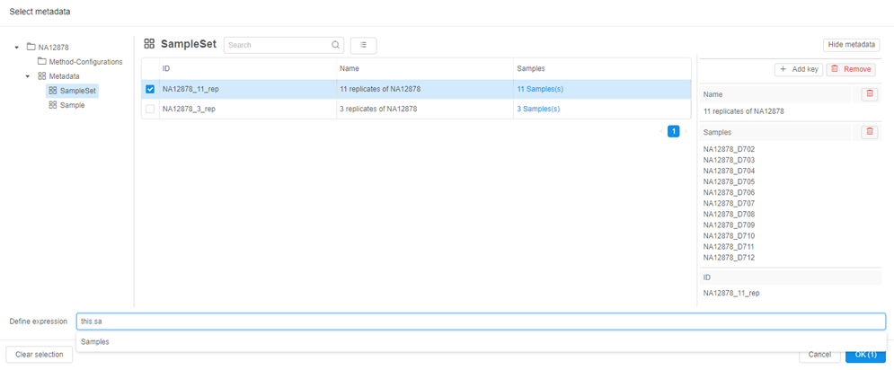

# 7.3. Expansion Expressions

As the **Root entity** has a number of attributes and the entity is connected with other entities and their attributes, we need a special way to define them as parameters of configuration or be able to launch one entity metadata under a configuration with a different type of root entity.

For this purpose we use **expansion expressions**:

- **"this. ..."** - "this" keyword references a specific instance of an entity. It shall be followed by an attribute of an instance. Additionally, set of attributes of corresponding entities can be chained (see examples below).
  - **"this.attribute" - "this.fastq"**
  - **"this.attribute.attribute. ..."** - chaining allows creating more complex pipeline runs. In this case, each "attribute" keyword will be expanded and used as an input for the next "attribute". For example, "**this.control\_sample.r1\_fastq**".

**"this.attribute"** construction is also useful at **Root entity configuration** launching step when a user selects metadata:

- **Example 1**. The root entity for the configuration is "**Samples**", but user selects a "**Pair**" in the pop-up window. The "**Pair**" has a link to two **samples as attributes**. A user here should define the desired attribute (**sample**) to launch pipeline with the specified root entity. For example, type "**this.control\_sample**" in **Define expression** field.
- **Example 2**. The root entity is "**Samples**", but user selects "**Sample Set**" and wants to run the analysis for **all the samples in the set**.  A user here should type the following expression "**this.Samples**" in **Define expression** field.  
    
