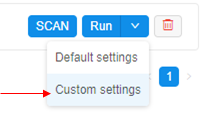
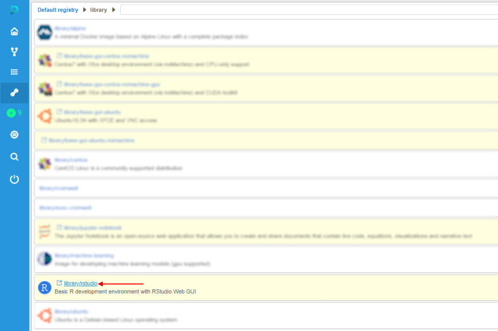
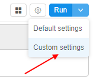
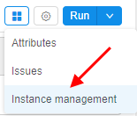
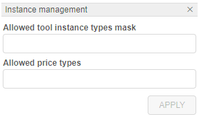

# 10.5. Launch a Tool

- [Launch the latest version](#launch-the-latest-version)
- [Launch particular Tool version](#launch-particular-tool-version)
- [Launch a Tool with "friendly" URL](#launch-a-tool-with-friendly-url)
- [Instance management](#instance-management)

> To launch a Tool you need to have **EXECUTE** permissions for it. For more information see [13. Permissions](../13_Permissions/13._Permissions.md).

## Launch the latest version

1. To run an instance with a selected **Tool** navigate to the **Tools** tab and click the **Tool name**.
2. Click the **Run** button in the top-right corner of the screen and the latest version with default settings will be launched (these are defined for Cloud Pipeline globally).  
    
3. If you want to change settings, you shall click the arrow near the **Run** button → **Custom settings**.  
    
4. **Launch tool** page will be open.  
    
5. Define the parameters in the **Exec environment**, **Advanced** and **Parameters** tabs.
6. Click the **Launch** button in the top-right corner of the screen.

## Launch particular Tool version

1. To run a particular version click the **Versions** section.
2. Select a version and click the **Run** button. The selected version with default settings will be launched (these are defined for Cloud Pipeline globally).  
    
3. If you want to change settings, you shall click the arrow near the **Run** button → **Custom settings**.  
    
4. **Launch a tool** page will be opened.
5. Define the parameters.
6. Click the "**Launch**" button.

### Example 1

In this example, we will run the "**base-gui-centos-nomachine**" Tool with custom settings: **20 Gb** hard drive, **2 CPU** cores, and **8 Gb** RAM. Pricing is calculated for a spot instance.  
**_Note_**: "Start idle" box is ticked to allow **SSH** access to the running Tool. To learn more about interactive services see [15. Interactive services](../15_Interactive_services/15._Interactive_services.md).  
Click the **Launch** button in the top-right corner of the screen when all parameters are set.  

After the **Tool** is launched you will be redirected to the **Runs** tab:

1. Click the **Log** button to see run details after instance finishes initialization.  
    
2. Click the **SSH** button in the **Run logs** page.  
    
3. You will be redirected to the page with interactive shell session inside the Docker container. For example, we can list "/" directory content inside the container.  
    

## Launch a Tool with "friendly" URL

User can specify a "Friendly URL" for persistent services. This produces endpoint URL in a more friendly/descriptive format: {cloud-pipeline\_url}/`friendly_url` instead of {cloud-pipeline\_url}/`pipeline-XXXX-XXXX`. It can be configured at a service launch time in the "**Advanced**" section of the Launch form.

### Example 2

In this example we will configure a pretty URL for rstudio Tool.  
**_Note_**: for do that, user account shall be registered within CP users catalog and granted **READ** & **EXECUTE** permissions for the rstudio Tool.

1. Navigate to the **Tools** tab.
2. In the **Default registry** select the **library/rstudio** Tool:  
    
3. On opened page hover the "**Run**" button and click on appeared "**Custom settings**" point:  
    
4. Click on "**Advanced**" control (**a**), input desired "**Friendly URL**" (**b**) (name shall be unique) and then click "**Launch**" button (**c**):  
    
5. Open logs page of rstudio Tool, wait until tool successfully started.
6. Click on hyperlink opposite "**Endpoint**" label:  
    
7. In a new tab RStudio will be opened. Check, the URL will be in "pretty" format, that you inputted on step 4:  
    

## Instance management

Instance management allows to set restrictions on instance types and price types for tool runs.

> User shall have **ROLE\_ADMIN** or to be an **OWNER** of the Tool to launch **Instance management** panel. For more information see [13. Permissions](../13_Permissions/13._Permissions.md).

To open **Instance management** panel:

1. Click  button in the left upper corner of the main tool page.
2. Click "Instance management":  
    
3. Such panel will be shown:  
    

On this panel you can specify some restrictions on allowed instance types and price types for launching tool.

Here you can specify:

| Field | Description | Example |
|---|---|---|
| **Allowed tool instance types mask** | This mask restrict for a tool allowed instance types. | If you want for that tool only some of "large m5..." instances types will be able, mask would be `m5*.large*`  In that case, before launching tool, dropdown list of available node types will be look like this:  |
| **Allowed price types** | In this field you may restrict, what price types will be allowed for a user. | If you want "On-demand" runs only for that tool will be able, select it in the dropdown list:  In that case, before launching tool, dropdown list of price types will be look like this:  |

To apply set restrictions for a tool click  button.

Setting restrictions on allowed instance types/price types is a convenient way to minimize a number of invalid configurations runs.  
Such restrictions could be set not only for a tool, but on another levels too.  
In CP platform next hierarchy is set for applying of inputted allowed instance types (sorted by priority):

- User level (specified for a user on "User management" tab) (see [v.0.14 - 12.4. Edit/delete a user](../12_Manage_Settings/12.4._Edit_delete_a_user.md#launch-options))
- User group level (specified for a group (role) on "User management" tab. If a user is a member of several groups - list of allowed instances will be summarized across all the groups) (see [v.0.14 - 12.6. Edit a group/role](../12_Manage_Settings/12.6._Edit_a_group_role.md#launch-options))
- Tool level (specified for a tool on "Instance management" panel) (see [above](#instance-management))
- _(global)_ **`cluster.allowed.instance.types.docker`** (specified on "Cluster" tab in "Preferences" section of system-level settings) (see [v.0.14 - 12.10. Manage system-level settings](../12_Manage_Settings/12.10._Manage_system-level_settings.md#cluster))
- _(global)_ **`cluster.allowed.instance.types`** (specified on "Cluster" tab in "Preferences" section of system-level settings) (see [v.0.14 - 12.10. Manage system-level settings](../12_Manage_Settings/12.10._Manage_system-level_settings.md#cluster))
