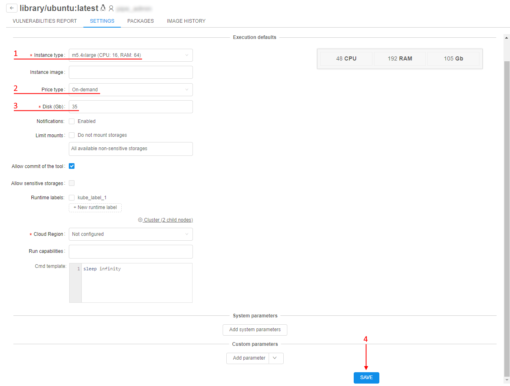

# 10.7. Tool version menu

- [Vulnerabilities report](#vulnerabilities-report)
- [Version settings](#version-settings)
- [Version packages](#version-packages)

To see the detailed info of Docker image version:

1. Click any **Tool version**:  
    
2. Tool version menu will be shown:  
    

## Vulnerabilities report

This tab contains the detailed info of the Docker image's scanning results.  
Here you can see vulnerable components (**a**). Each component has severity estimation (**b**):  

Expand each component details by clicking the "**Plus**" icon to see more information about it:  
**a**) link to a page of the vulnerability description  
**b**) the component version in which this vulnerability was fixed  
**c**) severity level  
**d**) short description of the vulnerability (it appears when hovering mouse pointer over the link **a**)  

Sort components alphabetically (**1**), or by their severity (**2**):  

## Version settings

On this tab version-level settings are defined. If these settings are specified - they will be applied to each run of the docker image version. If version-level settings are not defined: docker-level settings will be applied for launch. If docker-level settings are not defined: global defaults will be applied.  
There are 3 groups of parameters that user can specify (they are analogical to the "Execution environment" of tool settings, for more details see [here](10._Manage_Tools.md#settings-tab)):

- **Execution defaults**
- **System parameters**
- **Custom parameters**

For change version-level settings, e.g.:

1. Select an **Instance type** (e.g. _m4.large_).
2. Set the **Price type** (e.g. _Spot_).
3. Input the **Disk** size (e.g. _30Gb_).
4. Click **Save** button:  
    
5. Click  button to return into the tool menu.
6. Click **Run → Custom settings** for the changed tool version.
7. Check that version-level settings are applied:  
    

## Version packages

On this tab user can see the full list software packages installed into a specific Docker image.  
List of packages is generated from the docker version together with vulnerabilities scanning.  
This occurs nightly (all dockers are scanned) or if admin explicitly requests scanning by clicking **SCAN** button for a specific version.

Currently the following types of software packages can be scanned:

- System package manager's database (i.e. **yum**, **apt**)
- R packages
- Python packages

Software packages are combined into groups named "**Ecosystems**".  
To view content of any ecosystem, select it in the dropdown list:  

Information about each package contains:

1. Package name
2. Package description (*if available*)  
    

For filter/search packages type some text into a search-query field. Search will be done automatically across all **ecosystems**:  
    