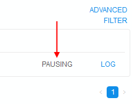

# 11.1. Pause/resume Runs

> Runs can be paused/resumed by users with **ROLE\_ADMIN** or **OWNERS**.

Cloud Platform currently provides functionality to launch and access services on Cloud hosted calculation nodes. Launching a service takes up to several minutes depending on multiple factors. When work with service is done, instance is terminated and all the local data and environment (installed tools, settings) are completely lost. In order to store the data it should be uploaded to Cloud data storage (AWS S3) before service termination, to save service environment user may user **COMMIT** option to update a service or create a new one, but for some use cases, e.g. script development in _RStudio_, these options may be inconvenient.

**PAUSE** and **RESUME** options allow to reduce time to start a service, have an option to store service state and to reduce expenses for idle services. Stopped instances cost less than running instances.  
**_Note_**: pause/resume options are available only for on-demand instances. **Price type** can be set during Run configuration in the **Advanced** tab.

## Pause/resume run

1. Find a run you want to pause in the **Active runs** tab and press **Pause**.  
    
2. Confirm pausing.
3. A Run will have status **PAUSING** for a short period of time.  
      
    Then **RESUME** option will appear.  
    
4. To resume the Run press the **Resume** button and confirm this action.
5. A Run will have status **RESUMING** for a short period of time.  
      
    Then a Run will continue working again.  
    