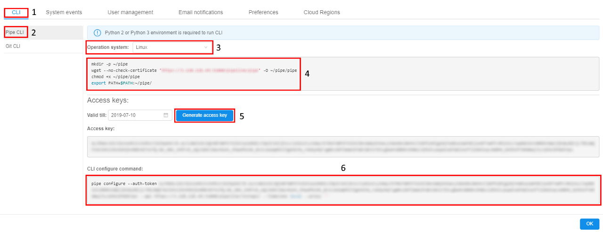

# 14.1. Install and setup CLI

How to install and setup **CLI**:

1. Go to **Settings** → **CLI** tab.
2. Select your Operation System from the list.
3. Follow the installation instructions for your OS (e.g. Linux). Commands below shall be executed in the Terminal.  
    When installation is finished, type **`pipe`** in the Terminal to test pipe installation. This command shall produce short description of pipe CLI and pipe CLI commands.
4. Press the **Generate access key** button.
5. Copy **CLI configure command** and run it in your Terminal to configure pipe CLI.  
    Now Cloud Pipeline **CLI** is ready to use.  
      
    **_Note_**: If any exceptions occur during installation, follow the instructions in the Terminal.  
    Notice that Python 2 / Python 3 has to be installed to run CLI. Python can be downloaded here <https://www.python.org/downloads/>.  
    **_Note_**: **pip** package manager is required for CLI installation if you selected **Operation System** → **Other** on step 2. Modern **Python** versions come bundled with **pip**. On top of that, with this type of installation you'll also need internet connection to install dependencies.