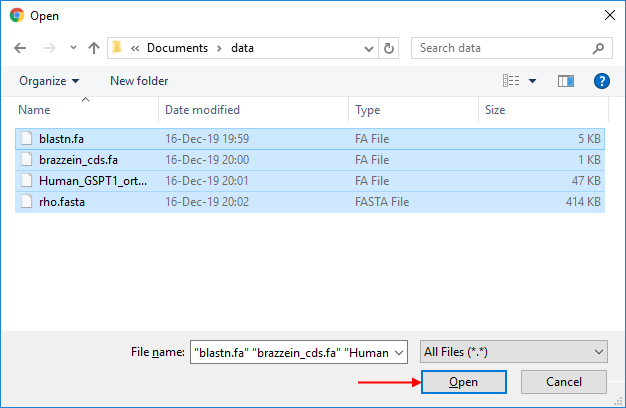

# 15.3. Expose node filesystem

- [Upload files through node's file browser](#upload-files-through-nodes-file-browser)
- [Download files/directories through node's file browser](#download-filesdirectories-through-nodes-file-browser)
- [Delete files/directories through node's file browser](#delete-filesdirectories-through-nodes-file-browser)
- [Search files/directories at node's file browser](#search-filesdirectories-at-nodes-file-browser)

> **Filesystem browser** is available for the **Active runs** only.  

To browse node filesystem go to the **Run logs** page. After a job had been initialized the `Browse` hyperlink become available to the users:  
    

Click the hyperlink to view the node's filesystem:  
    

User has an ability to view, download, upload, delete and search files and directories.  
To transfer between folders just click the folder and the system will open this folder to browse:  
    

**_Note_**: Storage has an auto-cleanup policy (to remove the temp files).

## Upload files through node's file browser

To upload files to the node filesystem press the `Upload` button:  
    

The local File Manager window will be opened. Select files that you want to upload and press the Open button:  
    

The Cloud Pipeline will display `Operations` list with all selected files and uploading statuses:  
    

After the uploading will be completed the system will update files statuses:  
      
To collapse the Operations window - press the cross button in the right-upper corner. The window will be collapsed:  
    

## Download files/directories through node's file browser

Download operation supports both files and directories. If a directory is requested for a download the result of such operation will be a gzipped tarball.

To download files or directories on your local machine from the node filesystem press the `Download` button:  
      

The Operations window will be open:  
    

The file or directory will be downloaded to your local machine after it's status in Operations window became `Downloaded`:  
    

If some directory was downloaded it will be saved as a gzipped tarball file:  
    

## Delete files/directories through node's file browser

To delete file or directory user needs to press the `Delete` button:  
      
  
The confirmation window will be displayed. Press OK to delete file or directory:  
      

## Search files/directories at node's file browser

To search inside the current directory through files and directories - click the address panel and type desired file or directory name:  
      

The result will be displayed to you. The string in the address panel is a path to the searched file or directory. So you can type a path to the file or directory and the result will be displayed to you right away.
