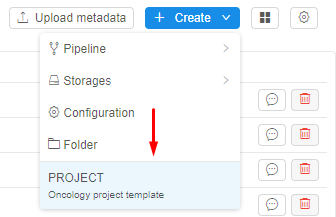
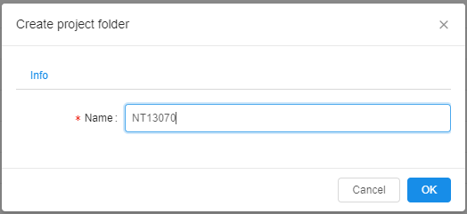
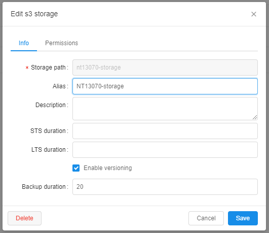
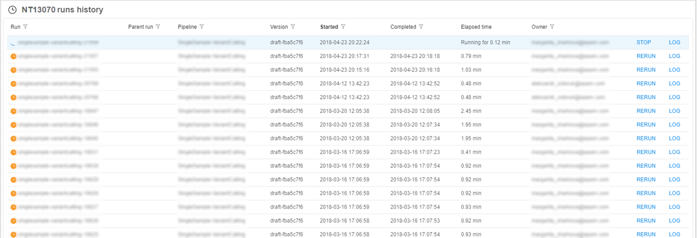

# Appendix B. Working with a Project

**Project** is a special type of **Folder**. **Projects** might be used to organize data and metadata and simplify analysis runs for a large data set. Also, you can set a project attributes as parameters of analysis method configuration.

**_Note_**: learn more about metadata [here](../05_Manage_Metadata/5._Manage_Metadata.md).

## Create a project

> To create a project you need **WRITE** permissions for the parent folder and **FOLDER\_MANAGER** role. For more information see [13. Permissions](../13_Permissions/13._Permissions.md).

To create a project in the system, the following steps shall be performed:

1. Navigate to a folder of a future-project destination.
2. Click **+ Create** → **PROJECT**.  
    **_Note_** PROJECT is an oncology project template. It supports the default structure of an oncology project.  
    
3. The system suggests that you name a new project.
4. Enter a name.  
    
5. Click **OK** button. You'll be fetched into the new project's parent folder page automatically.  
    
6. The folder has a default attribute: **type = project** (see picture above, **2**).  
    **_Note_**: It's an essential attribute for a project. Based on this attribute, the system recognizes a folder as a project. If the attribute is removed, the folder is no longer a project.
7. The new project contains (see picture above, **1**):
    - **Method-Configuration** folder. It will be a container for all your methods to run.
    - **Storage**. The storage will be empty. The name of the storage will be set as a default.  
          
        Here you can see default settings of new storage.  
        
    - **History**. This is a table that contains all at any time scheduled runs of a project's methods. For now, it's empty.  
        The picture below illustrated how the table looks with an existing run's history. The History GUI repeats the **Run** space. For more details see [11. Manage Runs](../11_Manage_Runs/11._Manage_Runs.md).
        
8. How to add metadata in the project, see [here](../05_Manage_Metadata/5._Manage_Metadata.md).